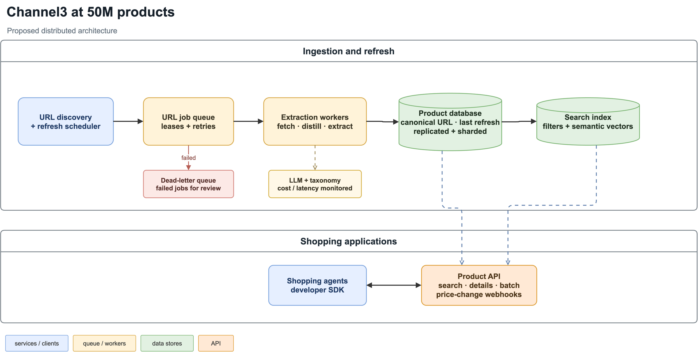

# Channel3 Take Home

## Overview

This project turns raw product-page HTML into validated `Product` records and serves them in a catalog and product-detail UI. It was built for the five assignment pages and exercised on 45 additional pages. Extraction uses page evidence rather than store-specific selectors.

## Demo

[](https://www.youtube.com/watch?v=X5n7xyM2d8I)

*Click to watch the walkthrough on YouTube.*

## Backend

Copy the config template and add your OpenRouter key as `OPEN_ROUTER_API_KEY` in `.env`:

```bash
cp .env.example .env
```

Install dependencies and extract the five assignment pages:

```bash
uv sync
uv run python run_extract.py
```

Results go to `output/*.json`. Add `--unseen` to process all 50 pages, or pass HTML file paths. Optional model and retrieval settings are in [`.env.example`](.env.example). Keep `OUTPUT_DIR=output` when using the server, which reads that folder.

## Server

Run the API and frontend in separate terminals:

```bash
uv run uvicorn server:app --port 8000
```

```bash
cd frontend && npm install && npm run dev
```

Open [localhost:5173](http://localhost:5173). `GET /products` returns catalog cards; `GET /products/{id}` returns the full product. The UI filters assignment and unseen pages and resolves variant selections on the product page. Restart the API after changing `output/` because it loads the catalog at startup.

## System Design

### Backend

1. **Harvest:** Read JSON-LD, meta tags, embedded JSON, script text, and visible page text from the raw HTML. Collect media URLs too, recording where each was found so a product image can be distinguished from a related-item image.
2. **Distill:** Use the page title and heading to keep evidence about the main product. Remove noisy data, summarize related products, group duplicate image renditions, and rank the remaining media. The result is a compact prompt with numbered image and video candidates.
3. **Extract:** A model turns that evidence into a draft with prices, descriptions, variants, category hints, and selected media indices. Code checks that prices appear in the evidence and media indices exist. An invalid draft gets a repair attempt, then a stronger model attempt.
4. **Categorize and assemble:** Word matching and, by default, local embeddings shortlist Google taxonomy paths. A model picks a numbered path, which `Category` validates. Finally, the selected media indices become URLs in the validated `Product` output.


Docs: [Backend design](docs/BACKEND.md) (Ace example) · [Backend implementation](docs/BACKEND_IMPLEMENTATION.md) (function trace).

### Server

The API loads saved `output/*.json` products at startup. `GET /products` returns summaries for the catalog, while `GET /products/{id}` returns one full product. Each response identifies whether its source page was an assignment or unseen page, which supports the catalog filter.

Docs: [Server design](docs/SERVER.md) · [Server implementation](docs/SERVER_IMPLEMENTATION.md).

### Frontend

The catalog fetches summaries, then filters and searches them in the browser. The product page fetches the full record, shows its gallery and details, and uses option selections to resolve a variant's price and SKU when the page supplied that combination. Availability stays in the data but is not shown as a stock claim.

Docs: [Frontend design](docs/FRONTEND.md) · [Frontend implementation](docs/FRONTEND_IMPLEMENTATION.md).

## Results

The five assignment pages have [hand-written ground truth](eval/ground_truth/). Scores range from 0 to 1, where 1 means a full match. Each field is averaged across the five pages; **Overall** is the equal-weight average of nine fields (name, price, description, features, images, video, category, colors, and variants).

| | Name | Price | Description | Features | Images | Video | Category | Colors | Variants | Overall |
| --- | ---: | ---: | ---: | ---: | ---: | ---: | ---: | ---: | ---: | ---: |
| Pipeline | 1.00 | 1.00 | 1.00 | 1.00 | 0.86 | 1.00 | 1.00 | 1.00 | 0.89 | **0.972** |
| No-LLM baseline | 0.80 | 0.45 | 0.85 | 0.20 | 0.28 | 0.80 | 0.00 | 0.20 | 0.40 | 0.442 |

**Images** uses F1 over normalized image assets, rewarding both expected images found and extra images avoided. **Variants** checks option selections, price, and availability; for pages without verifiable combinations, it checks variant count and option names.

The baseline uses JSON-LD and meta tags with lexical category matching, so the difference reflects both the extra evidence channels and model selection. All 50 collected pages have saved outputs.

The 45 unseen pages expose differences the assignment five cannot: all four supported picker configurations score 5/5 on the assignment pages, but range from 43/50 to 48/50 across the full set.

These extraction models remain selectable with `EXTRACT_MODEL`. Their scores and costs are from earlier five-page runs; the currently saved outputs score 0.972.

| Extraction model | Historical score | Approx. cost/page |
| --- | ---: | ---: |
| `google/gemini-3-flash-preview` | 0.976 | $0.015–0.023 |
| `openai/gpt-5-mini` | 0.905 | ~$0.01 |
| `google/gemini-2.5-flash-lite` | 0.884 | ~$0.003 |

```bash
uv run python eval/score.py
uv run python eval/baseline.py
uv run python eval/score.py --baseline
uv run python eval/reachability.py
uv run python eval/taxonomy_bench.py
cd frontend && npx vitest run
```

`eval/score.py` exits non-zero below 0.999 overall; its current 0.972 result is therefore an expected non-zero exit.

## Categories

[`eval/taxonomy_bench.py`](eval/taxonomy_bench.py) checks the category already saved in each output against the [accepted paths](eval/expected_categories.json). It requires an exact match to one accepted path and makes no model calls.

The code supports all four combinations of retrieval mode and picker model. The saved outputs use the shipped row.

| Picker configuration | All 50 pages | Assignment 5 | Calls/page | Cost/page | Latency/page |
| --- | ---: | ---: | ---: | ---: | ---: |
| Lexical + flash-lite | 44/50 | 5/5 | 1 | $0.00034 | 1.2s |
| Lexical + 3-flash | 43/50 | 5/5 | 1 | $0.00172 | 1.7s |
| Union + flash-lite | 47/50 | 5/5 | 1 | $0.00028 | 1.0s |
| **Union + 3-flash (shipped)** | **48/50** | **5/5** | 1 | $0.00153 | 1.6s |

Union + flash-lite was rerun on all 50 pages with one pick per page. Its cost and latency are five-page averages for the category call; the other rows are earlier measurements. Extraction also reran, so the 47/50 versus 48/50 difference is not a controlled picker-only comparison. The old 45/50 union + flash-lite result used three votes and is no longer shown.

- **Lexical + flash-lite:** Word matching builds the category list; Flash-Lite picks one. Set `TAXONOMY_RETRIEVAL=lexical` and `PICK_MODEL=google/gemini-2.5-flash-lite` in `.env`.
- **Lexical + 3-flash:** The same word-matched list, with Gemini 3 Flash choosing. Set `TAXONOMY_RETRIEVAL=lexical` and `PICK_MODEL=google/gemini-3-flash-preview`.
- **Union + flash-lite:** Adds embedding matches before Flash-Lite chooses. Set `TAXONOMY_RETRIEVAL=union` and `PICK_MODEL=google/gemini-2.5-flash-lite`.
- **Union + 3-flash (default):** Adds embedding matches to the word-matched list before Gemini 3 Flash chooses. Set `TAXONOMY_RETRIEVAL=union` and `PICK_MODEL=google/gemini-3-flash-preview` (or leave both unset).

After changing `.env`, rerun `uv run python run_extract.py --unseen` to produce new category picks. Union uses embeddings when `fastembed` is installed; otherwise it uses lexical matches only.

## Design choices

- **Evidence-first extraction:** Python collects and distills product evidence before the model chooses fields. Budgets reduce model cost; code verifies prices, media indices, and taxonomy paths afterward.
- **Generic rules:** JSON is found by structure and commerce fields, without retailer-specific selectors or assignment-page examples in prompts.
- **Measured settings:** Ground truth, a no-model baseline, reachability checks, and the 50-page category benchmark guided model and retrieval choices.
- **Conservative output:** Variants need supported option combinations, and availability stays unknown without an explicit signal. Invalid drafts get repair and escalation attempts before failing.

## Limits

- **Evaluation scope:** The same author wrote the pipeline and ground truth, and scores come from single runs. Evidence notes, accepted category paths, and printed misses make judgments reviewable.
- **HTML coverage:** Raw HTML can miss client-rendered data or be blocked; complex variants and galleries also remain difficult. L.L.Bean scores 0.52 on variants, while its image F1 is 0.60 and Nike's is 0.70.
- **Availability:** Extracted stock signals are not displayed because raw HTML may show catalog status rather than live inventory.
- **Categories:** Two of 50 saved picks miss accepted paths. Embeddings use English; the model's translation of non-English hints has not been tested separately.

## System Design at Scale



To scale to 50M products, we would need distributed data processing. A good way to do this would be to add a scheduler that places URLs into a queue. Concurrent distributed workers would claim pages from the queue with a lease, fetch them, and run our extraction pipeline. These workers could also discover more pages to add to the queue. For each processed page, we should store a keyed value using the link and timestamp to record when it was last processed, since we will need to process it again for product updates. Each page should have a set number of retries with exponential backoff if processing fails, perhaps due to rate limiting. After the final failure, the job can move to a dead-letter queue. In our implementation, phase-based extraction should scale (if a single extraction doesn’t have major latency bottlenecks in our queue system). A cost analysis of how much budget we have for LLM calls should be made, and we should do more trade-off analyses of product extraction performance vs. cost (embedding latency should also be analyzed). We should also take a look at whether our pruning works well for more diverse websites and ensure we aren’t removing any vital info (we might need to add dynamic pruning to allocate different character limits for different website categories). Additionally, as we scrape global websites, we will probably find that there might be edge cases in our extraction ruleset for older or foreign websites. We would also now need a durable database to hold all this data (likely with replication, partitions, and sharding for end-user distribution).

If we wanted to support an agentic shopping AI, we should let agents search and filter by product, category, brand, price, and other available attributes, then fetch details via product IDs. The results should include variants, images, and timestamps (to show when they were last updated). We may be able to improve semantic query results by adding a vector-based embedding retrieval layer for agents (say, retrieve the top matches for a product). For the developer experience, we should provide an SDK that handles authentication, along with sample API requests. We could also support batch endpoints to easily compare or refresh products. A webhook feature for price changes to certain products would make the developer experience easier too (preventing unnecessary cron jobs).

Implementation notes: [backend](docs/BACKEND_IMPLEMENTATION.md), [server](docs/SERVER_IMPLEMENTATION.md), [frontend](docs/FRONTEND_IMPLEMENTATION.md), and [evaluation](docs/EVAL_IMPLEMENTATION.md).
