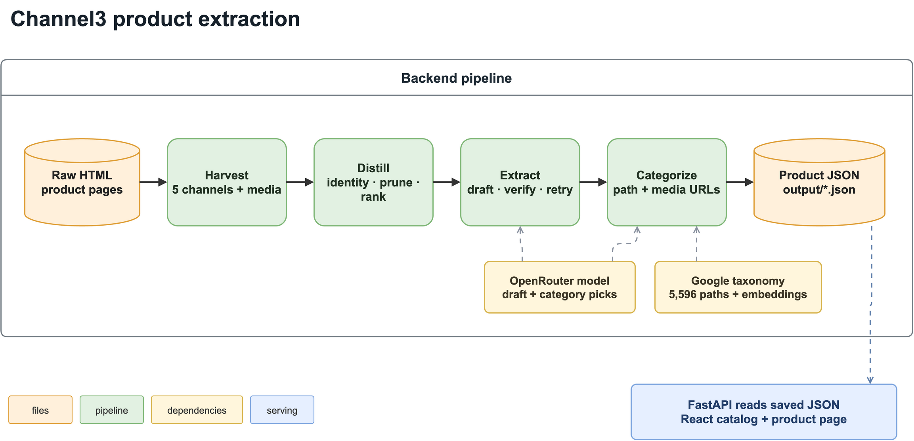

# Channel3 Take Home

## Overview

This project turns raw product-page HTML into validated `Product` records and serves them in a catalog and product-detail UI. It was built for the five assignment pages and exercised on 45 additional pages. Extraction uses page evidence rather than store-specific selectors.

## Backend

Copy the config template and add your OpenRouter key as `OPEN_ROUTER_API_KEY` in `.env`:

```bash
cp .env.example .env
```

Install dependencies and extract the five assignment pages:

```bash
uv sync
uv run python run_extract.py
```

Results go to `output/*.json`. Add `--unseen` to process all 50 pages, or pass HTML file paths. Optional model and retrieval settings are in [`.env.example`](.env.example). Keep `OUTPUT_DIR=output` when using the server, which reads that folder.

## Server

Run the API and frontend in separate terminals:

```bash
uv run uvicorn server:app --port 8000
```

```bash
cd frontend && npm install && npm run dev
```

Open [localhost:5173](http://localhost:5173). `GET /products` returns catalog cards; `GET /products/{id}` returns the full product. The UI filters assignment and unseen pages and resolves variant selections on the product page. Restart the API after changing `output/` because it loads the catalog at startup.

## How it works

### Backend

1. **Harvest:** Read JSON-LD, meta tags, embedded JSON, script text, and visible page text from the raw HTML. Collect media URLs too, recording where each was found so a product image can be distinguished from a related-item image.
2. **Distill:** Use the page title and heading to keep evidence about the main product. Remove noisy data, summarize related products, group duplicate image renditions, and rank the remaining media. The result is a compact prompt with numbered image and video candidates.
3. **Extract:** A model turns that evidence into a draft with prices, descriptions, variants, category hints, and selected media indices. Code checks that prices appear in the evidence and media indices exist. An invalid draft gets a repair attempt, then a stronger model attempt.
4. **Categorize and assemble:** Word matching and, by default, local embeddings shortlist Google taxonomy paths. A model picks a numbered path, which `Category` validates. Finally, the selected media indices become URLs in the validated `Product` output.



The diagram is [editable in draw.io](docs/backend-pipeline.drawio).

Docs: [Backend design](docs/BACKEND.md) (Ace example) · [Backend implementation](docs/BACKEND_IMPLEMENTATION.md) (function trace).

### Server

The API loads saved `output/*.json` products at startup. `GET /products` returns summaries for the catalog, while `GET /products/{id}` returns one full product. Each response identifies whether its source page was an assignment or unseen page, which supports the catalog filter.

Docs: [Server design](docs/SERVER.md) · [Server implementation](docs/SERVER_IMPLEMENTATION.md).

### Frontend

The catalog fetches summaries, then filters and searches them in the browser. The product page fetches the full record, shows its gallery and details, and uses option selections to resolve a variant's price and SKU when the page supplied that combination. Availability stays in the data but is not shown as a stock claim.

Docs: [Frontend design](docs/FRONTEND.md) · [Frontend implementation](docs/FRONTEND_IMPLEMENTATION.md).

## Results

The five assignment pages have [hand-written ground truth](eval/ground_truth/). Scores range from 0 to 1, where 1 means a full match. Each field is averaged across the five pages; **Overall** is the equal-weight average of nine fields (name, price, description, features, images, video, category, colors, and variants).

| | Name | Price | Description | Features | Images | Video | Category | Colors | Variants | Overall |
| --- | ---: | ---: | ---: | ---: | ---: | ---: | ---: | ---: | ---: | ---: |
| Pipeline | 1.00 | 1.00 | 1.00 | 1.00 | 0.86 | 1.00 | 1.00 | 1.00 | 0.89 | **0.972** |
| No-LLM baseline | 0.80 | 0.45 | 0.85 | 0.20 | 0.28 | 0.80 | 0.00 | 0.20 | 0.40 | 0.442 |

**Images** uses F1 over normalized image assets, rewarding both expected images found and extra images avoided. **Variants** checks option selections, price, and availability; for pages without verifiable combinations, it checks variant count and option names.

The baseline uses JSON-LD and meta tags with lexical category matching, so the difference reflects both the extra evidence channels and model selection. All 50 collected pages have saved outputs.

The 45 unseen pages expose differences the assignment five cannot: all four supported picker configurations score 5/5 on the assignment pages, but range from 43/50 to 48/50 across the full set.

These extraction models remain selectable with `EXTRACT_MODEL`. Their scores and costs are from earlier five-page runs; the currently saved outputs score 0.972.

| Extraction model | Historical score | Approx. cost/page |
| --- | ---: | ---: |
| `google/gemini-3-flash-preview` | 0.976 | $0.015–0.023 |
| `openai/gpt-5-mini` | 0.905 | ~$0.01 |
| `google/gemini-2.5-flash-lite` | 0.884 | ~$0.003 |

```bash
uv run python eval/score.py
uv run python eval/baseline.py
uv run python eval/score.py --baseline
uv run python eval/reachability.py
uv run python eval/taxonomy_bench.py
cd frontend && npx vitest run
```

`eval/score.py` exits non-zero below 0.999 overall; its current 0.972 result is therefore an expected non-zero exit.

## Categories

[`eval/taxonomy_bench.py`](eval/taxonomy_bench.py) checks the category already saved in each output against the [accepted paths](eval/expected_categories.json). It requires an exact match to one accepted path and makes no model calls.

The code supports all four combinations of retrieval mode and picker model. The saved outputs use the shipped row.

| Picker configuration | All 50 pages | Assignment 5 | Calls/page | Cost/page | Latency/page |
| --- | ---: | ---: | ---: | ---: | ---: |
| Lexical + flash-lite | 44/50 | 5/5 | 1 | $0.00034 | 1.2s |
| Lexical + 3-flash | 43/50 | 5/5 | 1 | $0.00172 | 1.7s |
| Union + flash-lite | 47/50 | 5/5 | 1 | $0.00028 | 1.0s |
| **Union + 3-flash (shipped)** | **48/50** | **5/5** | 1 | $0.00153 | 1.6s |

Union + flash-lite was rerun on all 50 pages with one pick per page. Its cost and latency are five-page averages for the category call; the other rows are earlier measurements. Extraction also reran, so the 47/50 versus 48/50 difference is not a controlled picker-only comparison. The old 45/50 union + flash-lite result used three votes and is no longer shown.

- **Lexical + flash-lite:** Word matching builds the category list; Flash-Lite picks one. Set `TAXONOMY_RETRIEVAL=lexical` and `PICK_MODEL=google/gemini-2.5-flash-lite` in `.env`.
- **Lexical + 3-flash:** The same word-matched list, with Gemini 3 Flash choosing. Set `TAXONOMY_RETRIEVAL=lexical` and `PICK_MODEL=google/gemini-3-flash-preview`.
- **Union + flash-lite:** Adds embedding matches before Flash-Lite chooses. Set `TAXONOMY_RETRIEVAL=union` and `PICK_MODEL=google/gemini-2.5-flash-lite`.
- **Union + 3-flash (default):** Adds embedding matches to the word-matched list before Gemini 3 Flash chooses. Set `TAXONOMY_RETRIEVAL=union` and `PICK_MODEL=google/gemini-3-flash-preview` (or leave both unset).

After changing `.env`, rerun `uv run python run_extract.py --unseen` to produce new category picks. Union uses embeddings when `fastembed` is installed; otherwise it uses lexical matches only.

## Design choices

- **Code and model responsibilities:** Python collects possible facts from the page, and the model decides which ones describe the product. Code then checks the result. This leaves routine parsing to Python and uses the model for ambiguous choices.
- **Evidence distillation:** The HTML is reduced to a small, product-focused evidence packet before extraction. Removing unrelated products and page noise keeps model calls cheaper.
- **Generic extraction rules:** Extraction uses no retailer-specific selectors. JSON is found by its structure and commerce fields, while generic noise rules and prompts without assignment-page examples let the same code handle unseen sites.
- **Model and retrieval evaluation:** Ground truth, a no-model baseline, reachability checks, and category benchmarks guided the model and retrieval settings. The reachability check also shows whether a missing fact was lost before the model saw it.
- **Output validation:** The model picks media by index, prices must appear in the page evidence, and categories must be valid taxonomy paths. These checks stop invented URLs and prices absent from the page.
- **Variants and failure handling:** Variants are returned only when the page supports a specific option combination, and availability stays unknown without an explicit signal. Invalid drafts get repair and escalation attempts before failing; the UI resolves only variants that were actually extracted.

## Limits

- **Evaluation ownership:** The same author built the pipeline and wrote its ground truth. Evidence notes record key labeling decisions, the category benchmark accepts multiple defensible paths, and both scorers print misses for others to re-judge.
- **Single-run results:** Model output can vary, especially on complex pages such as L.L.Bean. Each reported score comes from one run of its configuration, not repeated trials with a mean and variance.
- **Availability display:** Availability is extracted but deliberately omitted from the UI. Raw HTML stock signals may describe catalog status rather than live inventory, and a wrong stock claim would mislead shoppers.
- **HTML coverage:** Raw HTML can omit client-rendered product data, and some stores block collection altogether.
- **Product boundaries:** Complex variant joins and multi-color galleries remain difficult. L.L.Bean scores 0.52 on variants; L.L.Bean and Nike image F1 scores are 0.60 and 0.70.
- **Category precision:** The taxonomy can be ambiguous or lack a precise path; two of the 50 saved category picks miss the accepted set.
- **English category hints:** The embedding index is English, so the model writes English hints even for Japanese or German pages. That implicit translation has not been tested separately.
- **Embedding setup:** Without `fastembed`, union retrieval quietly falls back to lexical matches. On a fresh machine, it downloads roughly 100 MB of model files and builds the cached category index (about 30 seconds).

## System design

At 50 million products, I would replace local files and the startup-loaded catalog with a queue of page-ingestion jobs, stateless workers, object storage for raw HTML, and versioned product records in a database and search index. Workers would deduplicate canonical URLs, record source evidence and extraction versions, retry transient fetch failures, and reprocess pages when parsers change. Deterministic checks would handle clear cases; model calls would be reserved for ambiguous evidence and tracked for cost and quality. The current in-memory catalog and per-page model calls would not scale as written.

For shopping applications, I would expose a versioned API for search, filters, product details, offers, variants, availability, and source freshness, with cursor pagination and stable product IDs. Change feeds or webhooks would let clients refresh listings. Typed SDKs and tool schemas would make the same data usable by storefronts and shopping agents, while provenance fields would let them distinguish verified page facts from inferred fields.

Implementation notes: [backend](docs/BACKEND_IMPLEMENTATION.md), [server](docs/SERVER_IMPLEMENTATION.md), [frontend](docs/FRONTEND_IMPLEMENTATION.md), and [evaluation](docs/EVAL_IMPLEMENTATION.md).
